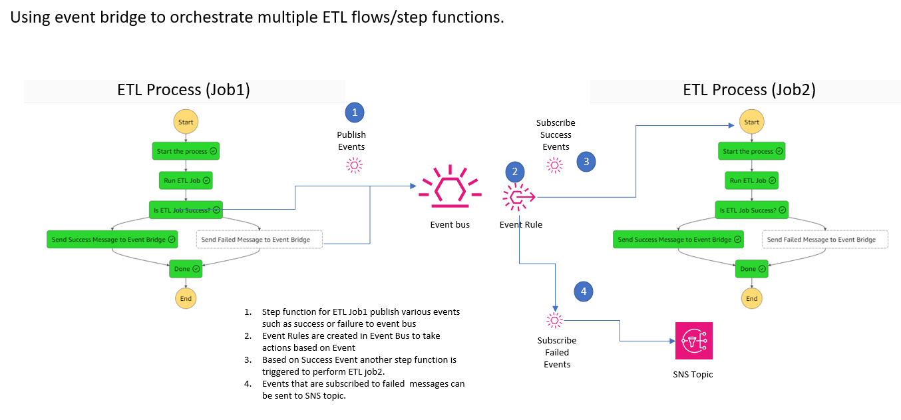

# Using event bridge to orchestrate multiple ETL flows/step functions. 

## Introduction

AWS Step Functions now integrates with Amazon EventBridge to provide a simpler solution for producing events during a workflow. 

EventBridge allows you to route events between AWS services, integrated software as a service (SaaS) applications, and your own applications. Event producers publish events onto an event bus, which uses rules to determine where to send those events. The rules can specify one or more targets, which can be other AWS services or API Destinations. This model makes it easier to develop scalable, distributed serverless applications by handling event routing and filtering.

## Solution architecture




* Step function for ETL Job1 publish various events such as success or failure to event bus 
* Event Rules are created in Event Bus to take actions based on Event
* Based on Success Event another step function is triggered to perform ETL job2. 
* Events that are subscribed to failed  messages can be sent to SNS topic. 

## Creating event bus

AWS Eventbridge by default comes with eventbus name "default". you can create your own event bus for your application. Think of event bus like Kafka topic. 

### EventBridge has a broad number of applications and use cases:

* When a message is to be sent to multiple consumers with minimal coupling, and when the number of consumers can grow over time.
* To build an event backbone: a general-purpose bus where lifecycle events can be published without having to consider the needs of all consumers up front. An event backbone provides support for event-driven applications for many message types where the event producer and consumers are not necessarily aware of each other. We will discuss a more concrete example for this use case in the next section.
* To create integrations between multiple components, AWS applications, different AWS accounts and between applications running on AWS and third-party vendors. It’s useful to think of EventBridge as a go-to solution for any type of integration where loose coupling is required.
* To handle events by sending them directly to other AWS services. EventBridge is well-integrated to many other AWS products, reducing the amount of custom code required for data transformation and forwarding.
### On the other hand, EventBridge is not well suited to some cases, in particular:

* Where near real-time latency is required consistently.
* When strict ordering of messages is required.

Following code snippet from template.yaml file creates event bus

```
  EventBridgeEventBus:
    Type: AWS::Events::EventBus
    Properties: 
      Name: !Ref NewETLEventBusName
```

## sending events to event bus 

> The above code block in step function send “putevent” to EventBusName “New-Etl-EventBus" with detail type of “new-etl-success” with event message saying “ETL Orchestration is Complete”. 

```
    "Send Success Message to Event Bridge":{
      "Type":"Task",
      "Resource":"arn:aws:states:::events:putEvents",
      "Parameters":{
         "Entries":[
            {
               "Detail":{
                  "Message":{
                     "message":"Info:NewETL:ETL Orchestration  is Complete...:"
                  },
                  "state":"data-load-success"
               },
               "DetailType":"new-etl-success",
               "EventBusName":"${EventBridgeEventBus}",
               "Source":"newetl1.job"
            }
         ]
      },
      "Next":"Done"
   },
   ```
## subscibing events to event bridge

Following code snippet in template.yaml file will allow you to subscribe events . In this case we are subscibing to both failed and success ( detail-type :new-etl-success or new-etl-error ) messages to trigger another step function. 

```
  EventBridgeInfoRule:
    Type: AWS::Events::Rule
    Properties:
      Description: Step Functions Info Events Bus Rule
      Name: New-Etl-Event-Rule-1
      EventBusName: !Ref  EventBridgeEventBus
      EventPattern:
        source:
          - newetl1.job
        detail-type:
          - new-etl-success
          - new-etl-error
      State: ENABLED
      Targets:
        - Arn: !GetAtt Etl2ProcesStateMachine.Arn
          Id: SFFunctionV1
          RoleArn: !GetAtt EventsRuleRole.Arn
```


